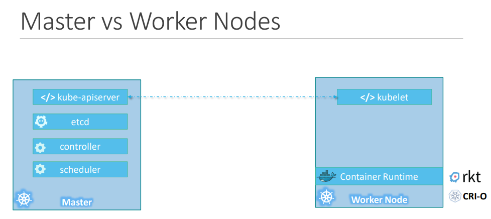

# Kubernetes

## Container Orchestration
When we have our application packaged into a docker container, how do we run it in production? What if your application relies on other containers such as database or messaging services or other backend services? What if the number of users increase and you need to scale your application? You would also like to scale down when the load decreases. \
To enable these functionalities you need an underlying platform with a set of resources. The platform needs to orchestrate the connectivity between the containers and automatically scale up or down based on the load. This whole process of automatically deploying and managing containers is known as Container Orchestration.

## Kubernetes Advantages

There are various advantages of container orchestration:
* Your application is now highly available as hardware failures do not bring your application down because you have multiple instances of your application running on different nodes. 
* The user traffic is load balanced across the various containers. 
* When demand increases, deploy more instances of the application seamlessly and within a matter of second and we have the ability to do that at a service level. 
* When we run out of hardware resources, scale the number of nodes up/down without having to take down the application. 
And do all of these easily with a set of declarative object configuration files.

## Architecture

### Nodes (Minions)
A node is a machine – physical or virtual – on which kubernetes is installed. A node is a worker machine and this is where containers will be launched by kubernetes. 

### Clusters
A cluster is a set of nodes grouped together. This way even if one node fails you have your application still accessible from the other nodes. Moreover having multiple nodes helps in sharing load as well

### Master
The master is another node with Kubernetes installed in it, and is configured as a Master. The master watches over the nodes in the cluster and is responsible for the actual orchestration of containers on the worker nodes.
It is responsible for managing the cluster, storing information about the members of the cluster and moving the workload of the failed node to another worker node.

## Components

When you install Kubernetes on a System, you are actually installing the following components:

* API server acts as the front-end for kubernetes. The users, management devices, Command line interfaces all talk to the API server to  interact with the kubernetes cluster.
* etcd is a distributed reliable key-value store used by kubernetes to store all data used to manage the cluster and responsible for implementing locks within the cluster to ensure there are no conflicts between the Masters. 
* The scheduler is responsible for distributing work or containers across multiple nodes. It looks for newly created containers and assigns them to Nodes.
* The controllers are the brain behind orchestration. They are responsible for noticing and responding when nodes, containers or endpoints goes down. The controllers makes decisions to bring up new containers in such cases.
* The container runtime is the underlying software that is used to run containers. 
* kubelet is the agent that runs on each worker node in the cluster. The agent is responsible for making sure that the containers are running on the nodes as expecte, interacting with the master to provide health information of the worker node and carry out actions requested by the master on the worker nodes. 

## Kubectl

The kube control tool or kube command line tool is used to deploy and manage applications on a kubernetes cluster, to get cluster information, get the status of nodes in the cluster and many other things. 

## Kubernetes Concept

* [Pod](pod/README.md)
* [ReplicaSet](replicaset/README.md)
* [Deployment](deployment/README.md)
* [Networking](network/README.md)
* [Service](service/README.md)