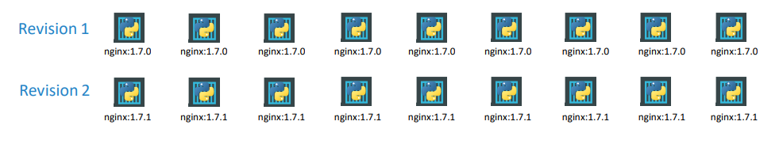
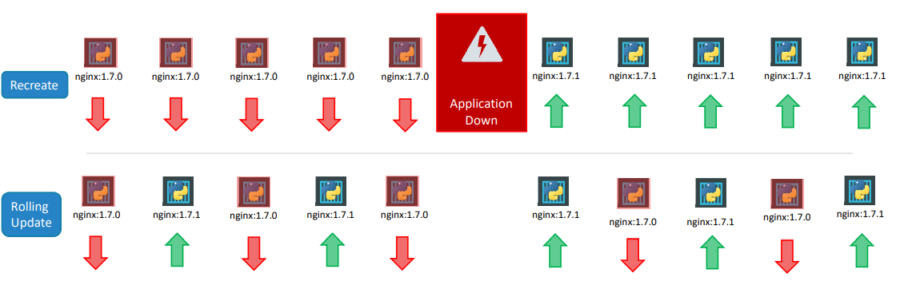

# Deployment

### Example
You have a web server that needs to be deployed in a production environment. You need not ONE, but many such instances of the web server running for obvious reasons. \
Secondly, when newer versions of application builds become available on the docker registry, you would like to UPGRADE your docker instances seamlessly. However, when you upgrade your instances, you do not want to upgrade all of them at once as we just did. This may impact users accessing our applications, so you may want to upgrade them one after the other. And that kind of upgrade is known as Rolling Updates. \
Suppose one of the upgrades you performed resulted in an unexpected error and you are asked to undo the recent update. You would like to be able to rollback the changes that were recently carried out.
Finally, you would like to make multiple changes to your environment such as upgrading the underlying WebServer versions, as well as scaling your environment and also modifying the resource allocations. 
You do not want to apply each change immediately after the command is run, instead you would like to apply a pause to your environment, make the changes and then resume so that all changes are rolled-out together.

**All of these capabilities are available with the kubernetes Deployments.** \

The deployment provides us with capabilities to upgrade the underlying instances seamlessly using rolling updates, undo changes, and pause and resume changes to deployments.

### Template

```
apiVersion: apps/v1
kind: Deployment
metadata:
  name: rs-name
  labels:
    [list label of this rc]
spec:
  template: 
    [these lines contain pod definition, including metadata and spec section]
  replicas: [number of replica]
  selector:
    matchLabels:
      [label that will be used to know which pods to monitor]
```

## Rollout and Versioning



Whenever you create a new deployment or upgrade the images in an existing deployment it triggers a Rollout. A rollout is the process of 
gradually deploying or upgrading your application containers. \
A new rollout creates a new Deployment revision. This helps us keep track of the changes made to our deployment and enables us to rollback to a previous version of deployment if necessary.\

You can see the status of your rollout by running the command: 
```
kubectl rollout status [deployment-name]
```

To see the revisions and history of rollout run the command:
```
kubectl rollout history [deployment-name]
```

## Deployment Strategy



### Example 
You have 5 replicas of your web application instance deployed. One way to upgrade these to a newer version is to destroy all of these and then create newer versions of application instances. Meaning first, destroy the 5 running instances and then deploy 5 new instances of the new application version. The problem with this as you can imagine, is that during the period after the older versions are down and before any newer version is up, the application is down and inaccessible to users. This strategy is known as the Recreate strategy. \
The second strategy is were we do not destroy all of them at once. Instead we take down the older version and bring up a newer version one by one. This way the application never goes down and the upgrade is seamless. Rolling Update is the default Deployment Strategy.

### Command line

```
kubectl apply -f deployment-definition.yaml
OR
kubectl set image deployment/deployment-name [things you wanna change]
```

## Rollback

To rollback, run command:
```
kubectl rollout undo deployment/deployment-name
```