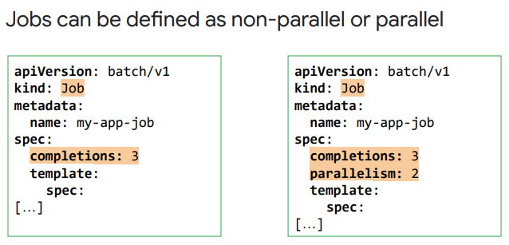
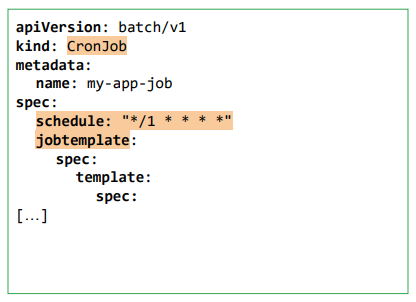

# JOB

A Job is a Kubernetes object like a Deployment. A Job creates one or more Pods to run a specific task reliably. 
In its simplest form, a Job will create one Pod and track the task completion within that Pod. 
**When the task is completed, it will terminate the Pod and report that the Job has successfully finished**

## How it works

There are two main ways to define a Job: non-parallel and parallel.

* Non-parallel Jobs create only one Pod at a time. Of course, that Pod is recreated if it terminates unsuccessfully. These Jobs are completed when the Pod terminates successfully, or—if a completion count is defined—when the required number of completions is reached. 

* Parallel Jobs are Jobs that have a parallelism value defined, where multiple Pods are scheduled to work on the Job at the same time. 
 If the completion count is set, Kubernetes considers Parallel Jobs complete when the number of Pods that have terminated successfully reaches the completion count. If not, 1 Pod terminating successfully then the Job considered to be ‘finished successfully'.

## Cron job

