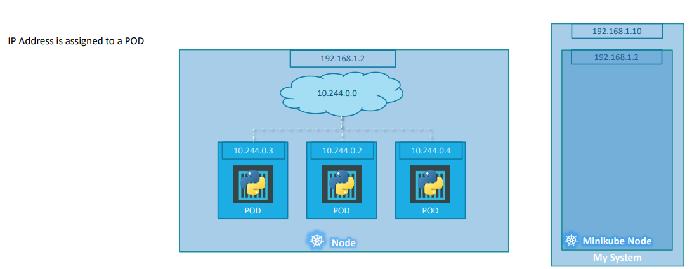
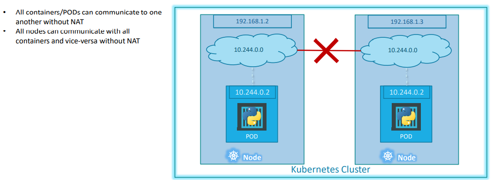

# Networking

In Kubernetes the IP address is assigned to a POD. Each POD in kubernetes gets its own internal IP Address. 

Example: 
* In the range 10.244 series and the IP assigned to the POD is 10.244.0.2. So how is it getting this IP address? 
* When Kubernetes is initially configured it creates an internal private network with the address 10.244.0.0 and all PODs are attached to it. 
* When you deploy multiple PODs, they all get a separate IP assigned. The PODs can communicate to each other through this IP.

**Accessing other PODs using this internal IP address MAY not be a good idea as its subject to change when PODs are recreated.**

Example:
* In this case, we have two nodes running kubernetes and they have IP addresses 192.168.1.2 and 192.168.1.3 assigned to them. Note that they are not part of the same cluster yet. Each of them has a single POD deployed. These pods are attached to an internal network and they have their own IP addresses assigned. 
* However, if you look at the network addresses, you can see that IPs are the same. The two networks have an address 10.244.0.0 and the PODs deployed have the same address too. It will lead to IP conflicts in the network. Now that’s ONE problem. 
* When a kubernetes cluster is setup, kubernetes does NOT automatically setup any kind of networking to handle these issues. K8s expects us to setup networking to meet certain fundamental requirements. 
* Some of fundemental requirements are that all the containers or PODs in a kubernetes cluster MUST be able to communicate with one another without having to configure NAT. All nodes must be able to communicate with containers and all containers must be able to communicate with the nodes in the cluster. 

## Solution 
ortunately, we don’t have to set it up ALL on our own as there are multiple pre-built solutions available. Some of them are the cisco ACI networks, Cilium, Big Cloud Fabric, Flannel, Vmware NSX-t and Calico. Depending on the platform you are deploying your Kubernetes cluster on you may use any of these solutions.