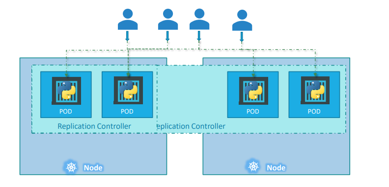
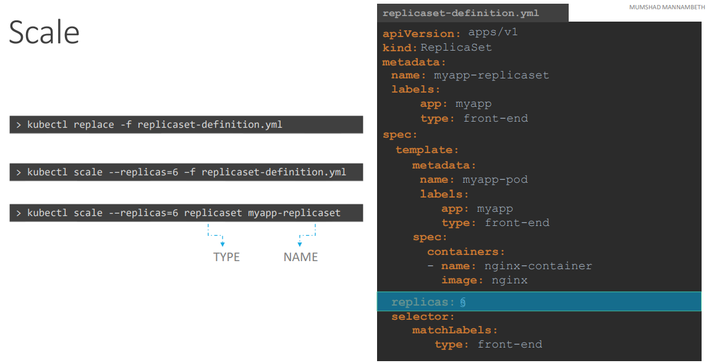

# ReplicaSet

## Replication Controller

### High Availability
Let’s go back to our first scenario were we had a single POD running our application. What if for some reason, our application crashes and the POD fails? Users will no longer be able to access our application. To prevent users from losing access to our application, we would like to have more than one instance or POD running at the same time. That way if one fails we still have our application running on the other one. The replication controller helps us run multiple instances of a single POD in the kubernetes cluster thus providing High Availability. 
The replication controller ensures that the specified number of PODs are running at all times. Even if it’s just 1 or 100.

### Load Balancing and Scaling



Another reason we need replication controller is to create multiple PODs to share the load across them. \
For example, in this simple scenario we have a single POD serving a set of users. When the number of users increase, we deploy additional POD to balance the load across the two pods. 
If the demand further increases and If we were to run out of resources on the first node, we could deploy additional PODs across other nodes in the cluster. 
As you can see, the replication controller spans across multiple nodes in the cluster. It helps us balance the load across multiple pods 
on different nodes as well as scale our application when the demand increases.

### Template for Replication Controller

```
apiVersion: v1
kind: ReplicationController
metadata:
  name: rc-name
  labels:
    [list label of this rc]
spec:
  template: 
    [these lines contain pod definition, including metadata and spec section]
  replicas: [number of replica]
```

### Template for Replica Set

```
apiVersion: apps/v1
kind: ReplicaSet
metadata:
  name: rs-name
  labels:
    [list label of this rc]
spec:
  template: 
    [these lines contain pod definition, including metadata and spec section]
  replicas: [number of replica]
  selector:
    matchLabels:
      [label that will be used to know which pods to monitor]
```

## Replication Controller vs Replicaset
Both have the same purpose but they are not the same. Replication Controller is the older technology that is being replaced by Replica Set. Replica set is the new recommended way to setup replication. 

### Selector
ReplicaSet requires a selector definition. It is one of the major differences between replication controller and replica set. The selector section helps the replicaset identify what pods fall under it. 
```
Why would you have to specify what PODs fall under it, if you have provided the contents of the pod-definition file itself in the template? 
Because ReplicaSet can manage pods that were not created as part of the replicaset creation. For example, there were pods created BEFORE the creation of the ReplicaSet that match the labels specified in the selector, the replica set will also take THOSE pods into consideration when creating the replicas.
```

## How to scale ReplicaSet




