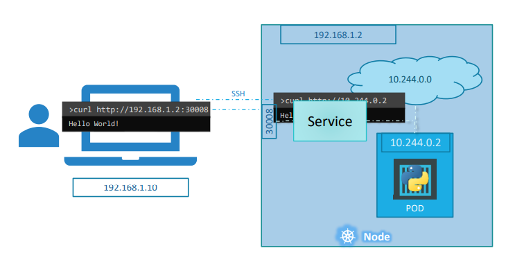
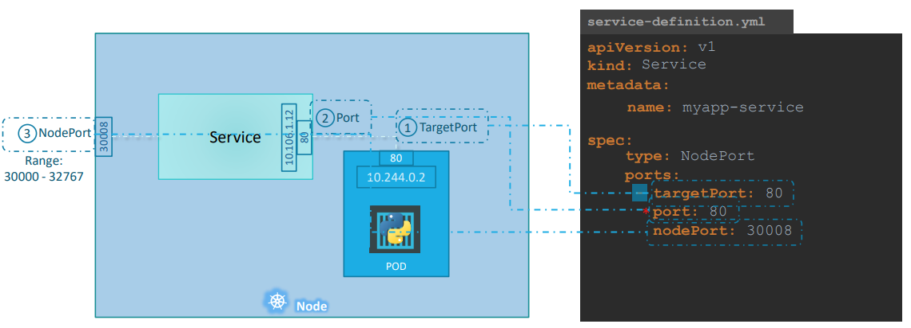
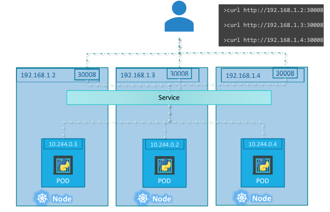
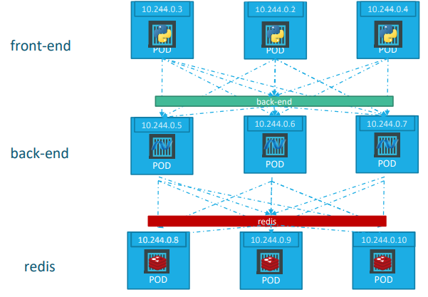
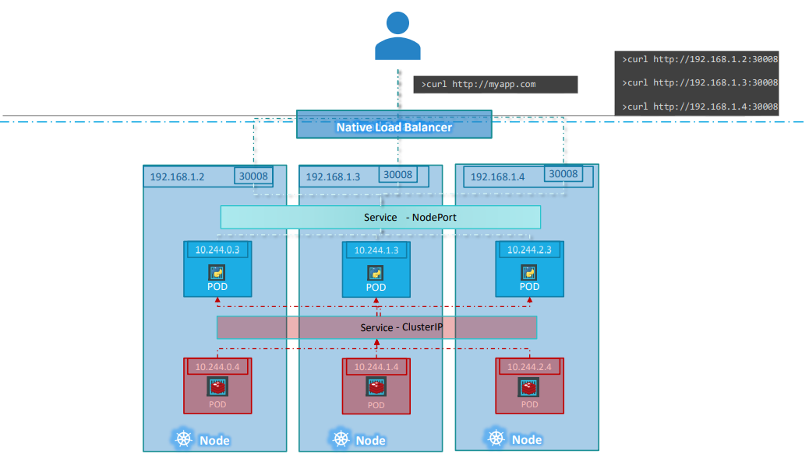

# SERVICE

Kubernetes Services enable communication between various components within and outside of the application. Kubernetes Services helps us connect applications together with other applications or users. 

Example:
Our application has groups of PODs running various sections, such as a group for serving front-end load to users, another group running back-end processes, and a third group connecting to an external data source. 
It is **Services** that enable connectivity between these groups of PODs. Services enable the front-end application to be made available to users, it helps communication between back-end and front-end PODs, and helps in establishing connectivity to an external data source. Thus services enable loose coupling between microservices in our application.

## Why service

Let’s start with external communication. How do **an external user** access the web page? 
* The Kubernetes Node has an IP address and that is 192.168.1.2. 
* My laptop is on the same network as well, so it has an IP address 192.168.1.10. 
* The internal POD network is in the range 10.244.0.0 and the POD has an IP 10.244.0.2. 
Clearly, I cannot ping or access the POD at address 10.244.0.2 as its in a separate network. 
So what are the options to see the webpage?
* Firstly, if we were to SSH into the kubernetes node at 192.168.1.2, from the node, we would be able to access the POD’s webpage by doing a curl or if the node has a GUI, we could fire up a browser and see the webpage in a browser following the address http://10.244.0.2.
* Secondly, The kubernetes service is an object just like PODs, Replicaset or Deployments. One of its use case is to listen to a port on the Node and forward requests on that port to a port on the POD running the web application. This type of service is known as a NodePort service because the service listens to a port on the Node and forwards requests to PODs.

## Types of Service

There are three types of services, including:
* NodePort: the service makes an internal POD accessible on a Port on the Node. 
* ClusterIP: the service creates a virtual IP inside the cluster to enable communication between different services such as a set of front-end servers to a set of backend servers. 
* LoadBalancer: it provisions a load balancer for our service in supported cloud providers. 

### NodePort

There are 3 ports involved.
* The port on the POD were the actual web server is running is port 80. It is where the service forwards the requests to. 
* The port on the service itself. The service is in fact like a virtual server inside the node. Inside the cluster it has its own IP address. And that IP address is called the Cluster-IP of the service.
* The port on the Node itself which we use to access the web server externally. Node Ports can only be in a valid range which is from 30000 to 32767

we will use a definition file to create a service. 
* The only mandatory field is port. Also note that ports is an array.
* If you don’t provide a targetPort it is assumed to be the same as port
* If you don’t provide a nodePort a free port in the valid range between 30000 and 32767 is automatically allocated. 

As we did with the replicasets previously, we will use labels and selectors to link these together. 

**Note:** If we have multiple similar PODs running our web application. They all have the same labels with a key app set to value myapp. The same label is used as a selector during the creation of the service. So when the service is created, it looks for matching PODs with the labels. The service then automatically selects all the PODs as **endpoints** to forward the external requests coming from the user. You don’t have to do any additional configuration to make this happen. It uses a random algorithm. Thus the service acts as a built-in load balancer to distribute load across different PODs.

If we have the web application on PODs on separate nodes in the cluster. When we create a service, Kubernetes creates a service that spans across all the nodes in the cluster and maps the target port to the SAME NodePort on all the nodes in the cluster. 
**This way you can access your application using the IP of any node in the cluster** and using the same port number which in this case is 30008.

### ClusterIP

Example:
* A web application has different kinds of PODs hosting different parts of an application: a number of PODs running a front-end web 
server, another set of PODs running a backend server, a set of PODs running a key-value store like Redis, another set of PODs running a persistent database like MySQL. 
* The web front-end servers need to connect to the backend-workers and the backend-workers need to connect to database as well as the redis services. 
* The PODs all have an IP address assigned to them and they are not static. 

what if the front-end POD at 10.244.0.3 need to connect to a backend service? Which of the 3 would it go to and who makes that decision?

**Solution:** A ClusterIP service can help us group these PODs together and provide a single interface to access the PODs in a group. 

In this case, ClusterIP Service created for the backend PODs will help group all the backend PODs together and provide a single interface for other PODs to access this service. The requests are forwarded to one of the PODs under the service randomly. Each layer can now scale or move as required without impacting communication between the various services. Each service gets an IP and name assigned to it inside the cluster and that is the name that should be used by other PODs to access the service.

### LoadBalancer

Example:
We have a 3 node cluster. Our application have two tier: a database service and a front-end web service for users to access the application.
* ClusterIP Service created for database service **available internally within the kubernetes cluster** for other applications to consume. 
* The next tier is web front-end. To expose the application to the end users, we create NodePort service. The users can access the pplication at any IP of my nodes with the port 30008. **The problem is** what IP do you give your end users to access your application?

**Solution:**
* Mannually, you will be required to setup a separate Load Balancer VM in your environment and configure it to forward requests that come to it to any of the IPs of the Kubernetes nodes. 
* **Using K8s Service**, if you're on a supported CloudPlatform, like Google Cloud Platform, I could leverage the native load balancing functionalities of the cloud platform to set this up. 
