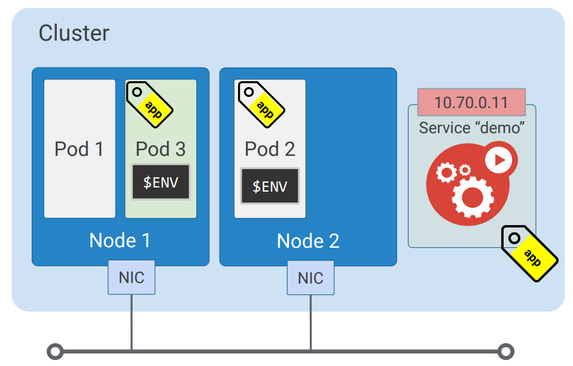
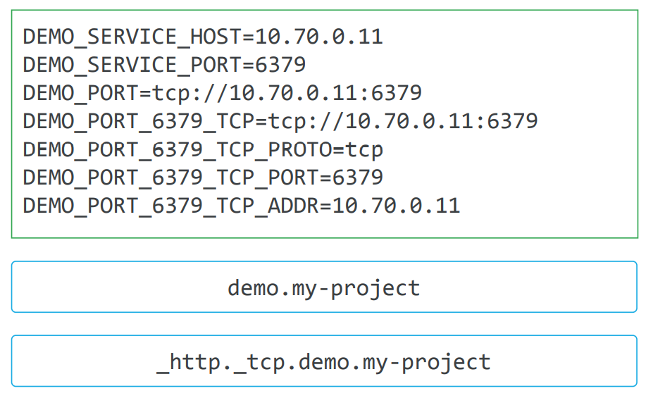

# How Service works

## Service Discovery



When **a new Pod** starts running on a node, kubelet adds to that Pod a set of environment variables for each active Service in the same namespace as the Pod. 

```
Ex: We have a Service that matches Pod 2; therefore if Pod 2 is started **after** the `demo` Service has been created, it has a set of environment variables for that Service.
```

Here's some env vars:




